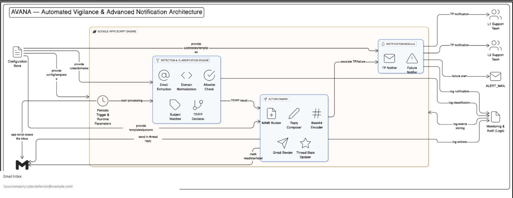

# AVANA (Automated Vigilance & Advanced Notification Assistant)

Unified DLP (Data Loss Prevention) Workflow Automation for CyberDefence Operations. Built as a Google Apps Script project, AVANA automates the detection, review, and notification pipeline for Google Workspace DLP alerts.

## Overview

AVANA orchestrates your organization's DLP incident triage through Gmail and Google Workspace Admin audit logs. It classifies each alert as a True Positive or False Positive, notifies the right people via email, and creates tickets in your ticketing system via webhooks.

### Key Capabilities

| Feature | Description |
|---|---|
| True Positive (TP) Detection | Auto-detects genuine DLP incidents and queues them for SOC review |
| False Positive (FP) Handling | Filters noise, suppresses duplicates, and auto-closes non-issues |
| Multi-Channel Alerts | Notifies via Email + webhook (real-time + ticket creation) |
| Internal Domain Allowlist | Handles intra-org mail with a configurable whitelist |
| Daily & Weekly Reporting | Auto-generates summary digests for CyberDefence leadership |
| Ticket Integration | Creates SOC tickets in your ticketing system via API |

## Architecture



## Sequence Diagram


## Project Structure

```
├── True Positive.js         # TP detection & alert pipeline
├── False Positive.js        # FP filtering & auto-closure
├── Daily_report.js          # Daily summary digest automation
├── Weekly_report.js         # Weekly summary digest automation
├── Ticket_Auth.js           # Ticketing system auth, webhook POST & ticket creation
├── Ticket_Test.js           # Ticketing diagnostics suite
├── appsscript.json          # Apps Script manifest
├── .clasp.json              # Clasp project mapping
└── docs/
    └── diagrams/
        ├── Architecture.png      # System architecture diagram
        └── Sequence Diagram.png  # End-to-end workflow sequence diagram
```

## Setup

### Prerequisites

- Google Workspace (Gmail + Admin SDK) with CyberDefence mailbox
- [clasp](https://github.com/google/clasp) installed: `npm i -g @google/clasp`
- A ticketing/notification system with a channel & webhook URL (JIRA, ServiceNow, Xyne, Slack, Discord, etc.)

### 1. Clone & configure

```bash
git clone https://github.com/Vinujavli/Google-AVANA-DLP.git
cd Google-AVANA-DLP
clasp login
```

### 2. Set your Script ID

Edit `.clasp.json` and replace the placeholder with your Apps Script ID:

```json
{
  "scriptId": "YOUR_SCRIPT_ID_HERE"
}
```

### 3. Set Script Properties

In your Apps Script project, go to **Project Settings → Script Properties**:

| Property | Description |
|---|---|
| `TICKET_TOKEN` | Your ticketing system's API token |
| `TICKET_CHANNEL_WEBHOOK_URL` | Your ticketing system's webhook URL (or Slack/Teams webhook) |
| `TICKET_TP_CHANNEL_ID` | (Optional) Channel ID for TP alerts routing |
| `TICKET_BOARD_ID` | (Optional) Board ID for ticket creation |

### 4. Update internal domains

Edit `True Positive.js` and `False Positive.js` — replace the placeholder `internalDomains` array with your organization's actual whitelist.

### 5. Deploy

```bash
clasp push
```

Then set up your time-driven triggers in Apps Script:

| Function | Schedule |
|---|---|
| `detectTruePositiveAndNotify()` | Every 5 min |
| `detectFalsePositiveAndClose()` | Every 5 min |
| `sendDailyReport()` | Daily, 9 AM |
| `sendWeeklyReport()` | Mon, 9 AM |

## Security Considerations

⚠️ **This repo has been sanitized for a personal portfolio.** The original production code contained live webhook tokens, real internal email addresses, Script IDs, and domain allowlists — all of which have been replaced with generic placeholders (`example.com`, `YOUR_*_HERE`).

If you're deploying to a live environment:
1. Rotate any exposed webhook tokens
2. Configure Script Properties with fresh credentials
3. Replace all `example.com` placeholders with real values
4. **Never commit live API tokens or webhook URLs to git**

## Support

For internal CyberDefence/L1-L2 escalation: contact your Security Operations admin.

---

*AVANA is an internal security automation tool. Built with Google Apps Script.*
